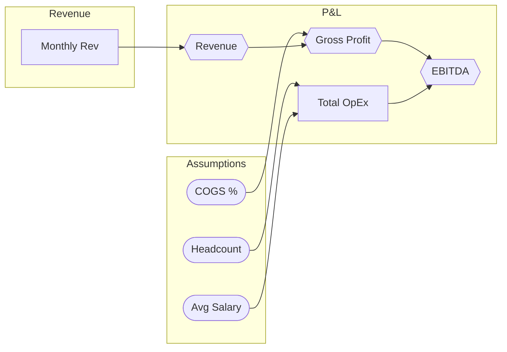

# ForecastAI + Claude Desktop: CFO Tutorial

> **How to have a real financial conversation with your Excel models.**

This guide shows how a CFO — or anyone who lives in financial models — interacts with
the ForecastAI MCP server through Claude Desktop.  No macros, no VBA, no Python.
Just a conversation.

---

## Table of Contents

1. [How It Works (One-Minute Overview)](#how-it-works)
2. [Setup Checklist](#setup-checklist)
3. [The Tool Inventory](#the-tool-inventory)
4. [Scenario A: First Look at a New Model](#scenario-a-first-look-at-a-new-model)
5. [Scenario B: Board Pack Prep — Audit Before You Publish](#scenario-b-board-pack-prep)
6. [Scenario C: Budget vs Actuals — Monthly Close](#scenario-c-budget-vs-actuals)
7. [Scenario D: Scenario Planning — Bear / Base / Bull](#scenario-d-scenario-planning)
8. [Scenario E: Dependency Investigation — "Why Did This Number Change?"](#scenario-e-dependency-investigation)
9. [Scenario F: Multi-File Model — Following the Data Chain](#scenario-f-multi-file-model)
10. [Scenario G: Time-Series Review — Spotting Anomalies](#scenario-g-time-series-review)
11. [Scenario H: Interactive Labelling — Building a Model Map](#scenario-h-interactive-labelling)
12. [Scenario I: Making a Safe Edit](#scenario-i-making-a-safe-edit)
13. [Prompt Reference Card](#prompt-reference-card)
14. [Tips and Best Practices](#tips-and-best-practices)

---

## How It Works

```
You (CFO)                Claude Desktop              ForecastAI MCP Server
    │                          │                              │
    │ "What's in this file?"   │                              │
    │ ─────────────────────►   │                              │
    │                          │  get_workbook_info_tool()    │
    │                          │ ────────────────────────►    │
    │                          │  {sheets, named ranges, ...} │
    │                          │ ◄────────────────────────    │
    │ "Here's what I found..." │                              │
    │ ◄─────────────────────   │                              │
```

**Key principle:** Claude reads your Excel files, reasons over them, and can write
changes back — but only when you explicitly ask.  Every destructive operation
offers a backup first.

Your Excel files live in `~/Documents/ForecastAI/` (configurable).
Drop any `.xlsx` file there and it is immediately accessible.

---

## Setup Checklist

- [ ] Claude Desktop installed and running
- [ ] ForecastAI MCP server installed (`pip install -e .` in the project folder)
- [ ] `claude_desktop_config.json` updated with the `forecast-ai-excel` server entry
- [ ] Excel files placed in `~/Documents/ForecastAI/`
- [ ] Claude Desktop restarted after config change
- [ ] Verify: type `"list my Excel files"` in Claude — you should see your files listed

---

## The Tool Inventory

| Category | Tool | What it does |
|----------|------|-------------|
| **Explore** | `get_workbook_info` | Sheet names, named ranges, file format |
| **Explore** | `read_sheet` | Full sheet contents with formulas |
| **Explore** | `get_cell` | Deep inspect one cell (formula, format, colour, comment) |
| **Explore** | `get_formulas` | Every formula in the workbook |
| **Explore** | `resolve_named_range` | Look up a named range like `Revenue_FY25` |
| **Explore** | `get_charts` | Charts embedded in the workbook |
| **Audit** | `run_audit` | 7-check integrity scan, health score 0–100 |
| **Variance** | `compare_workbooks` | Cell-by-cell diff of two files (Budget vs Actuals) |
| **Variance** | `compare_sheets` | Diff two sheets in the same file |
| **Variance** | `period_over_period` | Column-by-column comparison (Jan vs Feb) |
| **Scenarios** | `run_scenarios` | Bear/Base/Bull — non-destructive, in-memory |
| **Scenarios** | `build_sensitivity_table` | 2D table: two assumptions × one output |
| **Time Series** | `detect_time_axis` | Find which columns are time periods |
| **Time Series** | `analyse_timeseries` | Growth rates, CAGR, trend, anomalies per row |
| **Time Series** | `get_row_timeseries` | Deep-dive into one P&L line |
| **Dependencies** | `build_dependency_graph` | Full formula dependency map |
| **Dependencies** | `get_cell_precedents` | What feeds this cell? |
| **Dependencies** | `get_cell_dependents` | What does this cell drive? |
| **Dependencies** | `get_impact_summary` | How many cells would changing this affect? |
| **Dependencies** | `get_evaluation_order` | Topological order for recalculation |
| **Cross-File** | `scan_external_references` | Find and validate all `[OtherFile.xlsx]` links |
| **Cross-File** | `build_provenance_chain` | Recursive: "where does this number come from?" |
| **Labels** | `set_cell_label` | Tag a cell: name, category, note |
| **Labels** | `get_all_labels` / `get_labels_by_category` | Review the model map |
| **Labels** | `get_review_progress` | How much of the model is labelled? |
| **Visualise** | `get_dependency_diagram` | Mermaid diagram rendered in chat |
| **Visualise** | `export_dependency_html` | Interactive HTML graph, opens in browser |
| **Edit** | `update_cells` | Write values or formulas back to the workbook |
| **Edit** | `add_sheet` / `delete_sheet` | Sheet management |
| **Edit** | `backup_file` | Timestamped copy before any edit |

---

## Scenario A: First Look at a New Model

> **Situation:** The FP&A team has sent you `FY26_Operating_Model.xlsx`.
> You've never seen it before and the board meeting is in two days.

### Step 1 — Orient yourself

**You:**
> I just received `FY26_Operating_Model.xlsx` from the FP&A team. Can you give me a
> high-level orientation — what sheets are in it, what named ranges exist, and roughly
> how complex is it?

**Claude** *(calls `get_workbook_info_tool`)*:
> The workbook has **8 sheets**: Assumptions, Revenue, COGS, OpEx, P&L, Balance Sheet,
> Cash Flow, and Summary Dashboard.
>
> There are **23 named ranges**, including `Revenue_FY26`, `EBITDA_Margin_Target`,
> `Headcount_Total`, and `CapEx_FY26`.
>
> This is a mid-sized model. The most formula-dense sheet appears to be P&L.

---

### Step 2 — Run the audit immediately

**You:**
> Before I spend time reading this, run a full audit. I want to know if there are
> any integrity issues I should know about.

**Claude** *(calls `run_audit_tool`)*:
> **Health Score: 74 / 100** — some issues to review.
>
> | Severity | Count |
> |----------|-------|
> | 🔴 Error | 3 |
> | 🟡 Warning | 8 |
> | ℹ️ Info | 12 |
>
> **Top issues:**
>
> 🔴 **Broken external link** — `Revenue!B15` references `[DataFeed_2025.xlsx]Raw!C44`
> but that file is not in your workspace. This value may be stale.
>
> 🔴 **Formula error** — `Cash Flow!D22` contains `#REF!`. A row was likely deleted
> upstream.
>
> 🟡 **Hardcoded value** — `OpEx!C8` is a plain `450,000` in a row where every other
> month is a formula. Was this intentional?
>
> 🟡 **Possible unit error** — `Assumptions!B4` (`Interest Rate`) is `8.5`. This looks
> like it should be `0.085`. Rates in this model are usually expressed as decimals.
>
> Want me to drill into any of these?

---

### Step 3 — Dig into the #REF! error

**You:**
> Fix the #REF! in Cash Flow D22. First show me what the formula was supposed to be
> by looking at the surrounding cells.

**Claude** *(calls `read_sheet_tool`, then `get_cell_tool` on D21 and D23)*:
> The pattern is clear. D21 and D23 both reference `P&L!D{row}` with the same offset.
> D22 should be `=P&L!D22`.
>
> The current value is `#REF!` — the formula references a row that no longer exists.
>
> **Proposed fix:** Set `Cash Flow!D22` to `=P&L!D22`
>
> Shall I create a backup first, then apply this fix?

**You:**
> Yes, backup and fix it.

**Claude** *(calls `backup_file_tool`, then `update_cells_tool`)*:
> ✅ Backup saved as `FY26_Operating_Model_2026-03-11_143022.xlsx`
> ✅ `Cash Flow!D22` updated to `=P&L!D22`

---

## Scenario B: Board Pack Prep

> **Situation:** The board pack goes out Friday. You need to be certain the
> model is clean before the numbers are locked.

**You:**
> Run the full audit on `Board_Pack_March_2026.xlsx` and give me a prioritised
> action list — I want to resolve everything before Friday.

**Claude** *(calls `run_audit_tool` with all checks)*:
> **Health Score: 68 / 100** — I'd recommend resolving the errors before publishing.
>
> **Priority 1 — Fix now (Errors)**
> 1. `P&L!F30`: `#DIV/0!` — denominator is zero. Check if the base-period revenue
>    cell `P&L!F5` should be non-zero.
> 2. `Summary!C12` references `[Last_Year_Actuals.xlsx]` — file not found. Either
>    add the file to your workspace or hardcode the value with a note.
>
> **Priority 2 — Review (Warnings)**
> 3. `Assumptions!B3` (`Tax Rate`) = `28` — should this be `0.28`? Other rates in
>    row 3 use decimals.
> 4. `OpEx!B8:B11` — formula pattern breaks at B10 (hardcoded `120,000`). Did
>    someone override a formula?
> 5. 6 unlabelled cells are driving the EBITDA output. For board-level documentation
>    I'd recommend labelling them.
>
> **Priority 3 — Clean up (Info)**
> 6. 12 cells match the label pattern for "assumption" but are not yet labelled.
>    Not blocking, but useful for the model map.
>
> Want me to work through Priority 1 together?

---

## Scenario C: Budget vs Actuals — Monthly Close

> **Situation:** March actuals just came in. You have `Budget_FY26.xlsx` and
> `Actuals_Mar_2026.xlsx`. You need the variance report in 10 minutes.

**You:**
> Compare `Budget_FY26.xlsx` against `Actuals_Mar_2026.xlsx`. Focus on the
> Revenue and P&L sheets. Highlight anything unfavourable over $50K.

**Claude** *(calls `compare_workbooks_tool` with `sheet_filter=["Revenue","P&L"]`, `min_abs_variance=50000`)*:
> **Variance Report — Budget vs March Actuals**
> Sheets compared: Revenue, P&L | Threshold: $50K+
>
> | Cell | Description | Budget | Actual | Variance | Direction |
> |------|-------------|--------|--------|----------|-----------|
> | Revenue!C5 | Enterprise Revenue | $2.4M | $2.1M | -$300K | 🔴 Unfavourable |
> | Revenue!C8 | SMB Revenue | $820K | $910K | +$90K | 🟢 Favourable |
> | P&L!C22 | Gross Margin | 64.2% | 61.8% | -2.4pp | 🔴 Unfavourable |
> | P&L!C35 | Sales & Marketing | $540K | $610K | +$70K | 🔴 Unfavourable (over budget) |
> | P&L!C41 | EBITDA | $380K | $290K | -$90K | 🔴 Unfavourable |
>
> **Summary:** Enterprise revenue missed by $300K (likely the main driver of the
> EBITDA shortfall). S&M also ran $70K over. SMB was a bright spot.
>
> Want me to trace what's driving the Enterprise Revenue miss?

---

### Drilling into the revenue miss

**You:**
> Yes — trace the Enterprise Revenue cell and tell me what assumptions drive it.

**Claude** *(calls `get_cell_precedents_tool` on `Revenue!C5`, then reads those cells)*:
> `Revenue!C5` is calculated as:
> `= Enterprise_ACV * (1 + Growth_Rate) * Renewal_Rate`
>
> The inputs are:
> - `Assumptions!B8` Enterprise ACV: $1.85M (same in both files ✓)
> - `Assumptions!B9` Growth Rate: **Budget 12%, Actuals used 9%** ← gap here
> - `Assumptions!B11` Renewal Rate: **Budget 92%, Actuals 88%** ← gap here
>
> The shortfall is explained by lower growth and churn running ahead of plan.
> Neither assumption cell had a label or note explaining the change.
>
> Want me to label these cells and add a note explaining the March revision?

---

## Scenario D: Scenario Planning — Bear / Base / Bull

> **Situation:** The board wants to see downside sensitivity before approving the
> capex budget. You need three scenarios ready for Thursday.

**You:**
> Run Bear / Base / Bull scenarios on `FY26_Operating_Model.xlsx`.
> Assumptions to flex:
> - Bear: Revenue growth 5%, COGS margin 68%, churn 15%
> - Base: Revenue growth 12%, COGS margin 65%, churn 10%
> - Bull: Revenue growth 20%, COGS margin 62%, churn 7%
>
> Show me the impact on EBITDA (`P&L!B41`) and Free Cash Flow (`Cash Flow!B55`).

**Claude** *(calls `run_scenarios_tool`)*:
> **Scenario Analysis — FY26**
>
> | Metric | Bear | Base | Bull |
> |--------|------|------|------|
> | EBITDA | $1.2M | $3.8M | $6.1M |
> | vs Base | -$2.6M (-68%) | — | +$2.3M (+61%) |
> | Free Cash Flow | $0.4M | $2.1M | $4.5M |
> | vs Base | -$1.7M (-81%) | — | +$2.4M (+114%) |
>
> **Observation:** The Bear case puts FCF very close to zero ($0.4M), which is within
> the margin of uncertainty on capex timing. If churn comes in at 15%, the company
> would be cash-flow neutral — there's no buffer for the planned $800K equipment spend.
>
> Want me to build a sensitivity table showing EBITDA across a range of growth rates
> and churn rates?

---

### Sensitivity table

**You:**
> Yes — sensitivity table. Revenue growth from 4% to 22% (step 2%), churn from 7% to 17%.

**Claude** *(calls `build_sensitivity_table_tool`)*:
> **EBITDA Sensitivity Table**
> Rows = Revenue Growth | Columns = Churn Rate
>
> |  | 7% | 9% | 11% | 13% | 15% | 17% |
> |--|----|----|-----|-----|-----|-----|
> | **4%** | $2.1M | $1.7M | $1.3M | $0.9M | $0.5M | $0.1M |
> | **6%** | $2.6M | $2.2M | $1.8M | $1.4M | $1.0M | $0.6M |
> | **8%** | $3.1M | $2.7M | $2.3M | $1.9M | $1.5M | $1.1M |
> | **10%** | $3.5M | $3.1M | $2.7M | $2.3M | $1.9M | $1.5M |
> | **12%** | $4.0M | $3.6M | $3.2M | $2.8M | $2.4M | $2.0M |
> | **14%** | $4.4M | $4.0M | $3.6M | $3.2M | $2.8M | $2.4M |
>
> The model is roughly equally sensitive to growth and churn.
> EBITDA turns negative only in the extreme Bear case (4% growth + 17% churn).

---

## Scenario E: Dependency Investigation — "Why Did This Number Change?"

> **Situation:** The CFO notices EBITDA changed between the v1 and v2 model
> drafts, but nobody can explain why.

**You:**
> EBITDA in cell `P&L!B41` changed between the two model versions. Show me
> everything that feeds into that cell so I can find what changed.

**Claude** *(calls `get_cell_precedents_tool` with depth=3)*:
> `P&L!B41` (EBITDA) is driven by **47 cells** across 3 hops.
>
> **Direct inputs (1 hop):**
> - `P&L!B20` — Revenue
> - `P&L!B28` — Gross Profit
> - `P&L!B35` — Total OpEx
>
> **Key upstream inputs (2–3 hops):**
> - `Assumptions!B3` — Headcount (feeds OpEx via salary model)
> - `Assumptions!B7` — COGS %
> - `Assumptions!B12` — Average Salary (feeds headcount cost)
> - `Revenue!C5:C16` — Monthly revenue build
>
> Would you like me to compare these 47 cells between the v1 and v2 files to
> pinpoint exactly which assumption changed?

**You:**
> Yes, compare v1 and v2 and filter to just the cells that feed EBITDA.

**Claude** *(calls `compare_workbooks_tool` filtered to those cells)*:
> Found **1 change** in the cells that feed EBITDA:
>
> | Cell | Description | v1 | v2 | Change |
> |------|-------------|----|----|--------|
> | `Assumptions!B12` | Average Annual Salary | $95,000 | $112,000 | +$17K (+17.9%) |
>
> That's it. Someone updated the salary assumption between versions — a $17K increase
> across 34 headcount adds ~$578K to the OpEx line, which flows directly to EBITDA.

---

### Visualise the dependency graph

**You:**
> Show me the dependency diagram for the P&L sheet so I can see this structure visually.

**Claude** *(calls `get_dependency_diagram_tool` with `focus_cell="P&L!B41"`)*:



---

## Scenario F: Multi-File Model — Following the Data Chain

> **Situation:** The revenue model pulls data from a separate `DataFeed.xlsx` file.
> You want to understand the full data lineage before the audit.

**You:**
> Scan `FY26_Operating_Model.xlsx` for any external file references and tell
> me if they're all valid.

**Claude** *(calls `scan_external_references_tool`)*:
> Found **4 external references** in the model:
>
> | Referenced File | Status | Cells |
> |----------------|--------|-------|
> | `DataFeed_2025.xlsx` | ✅ Found in workspace | 3 cells |
> | `Actuals_Q3_2025.xlsx` | ✅ Found in workspace | 8 cells |
> | `HR_Headcount.xlsx` | ❌ **Not found** | 2 cells |
> | `CapEx_Schedule.xlsx` | ❌ **Not found** | 1 cell |
>
> `HR_Headcount.xlsx` and `CapEx_Schedule.xlsx` are missing. The cells that
> reference them will be using stale cached values from the last time the
> file was open with those source files present.

**You:**
> For the Revenue cell `Revenue!B5`, trace back through all the external
> files to find the ultimate source of that number.

**Claude** *(calls `build_provenance_chain_tool`)*:
> **Provenance chain for `Revenue!B5`:**
>
> ```
> FY26_Operating_Model.xlsx → Revenue!B5
>   = [DataFeed_2025.xlsx]Sales!C44   ✅ resolved
>       = [CRM_Export_Feb.xlsx]Deals!F112   ✅ resolved
>           = 847,500   (raw value — this is the ultimate source)
> ```
>
> The number originates in a CRM export cell `F112` in `CRM_Export_Feb.xlsx`.
> That file is a static snapshot — it would need to be refreshed to reflect
> March deals.

---

## Scenario G: Time-Series Review — Spotting Anomalies

> **Situation:** Before the investor update, you want to review the revenue trend
> and make sure nothing looks suspicious.

**You:**
> Analyse the time series for the P&L sheet in `FY26_Operating_Model.xlsx`.
> Flag any rows that have unusual jumps or statistical anomalies.

**Claude** *(calls `analyse_timeseries_tool`)*:
> **Time-Series Analysis — P&L Sheet (Jan–Dec 2025)**
>
> Analysed **18 rows** across 12 periods.
>
> **⚠️ Anomalous rows (values more than 2σ from trend):**
>
> | Row | Anomalous Period | Value | Expected Range | Notes |
> |-----|-----------------|-------|----------------|-------|
> | Sales & Marketing (Row 35) | August | $1.2M | $420K–$680K | Nearly 3× the trailing average |
> | Depreciation (Row 44) | March | $0 | $85K–$110K | Zero when it should never be zero |
>
> **📈 Fastest growing rows:**
> 1. SMB Revenue: **+38% CAGR** over the period
> 2. Professional Services: **+22% CAGR**
> 3. Enterprise Revenue: **+14% CAGR**
>
> The August S&M spike looks like a one-off event (conference? campaign?).
> The March Depreciation zero is likely a data error.
>
> Want me to drill into either of those?

**You:**
> Tell me more about the Revenue row — show me all periods, growth rates and trend.

**Claude** *(calls `get_row_timeseries_tool` for the Revenue row)*:
> **Revenue — Monthly Detail**
>
> | Period | Value | MoM Change |
> |--------|-------|------------|
> | Jan | $1.82M | — |
> | Feb | $1.91M | +4.9% |
> | Mar | $1.88M | -1.6% |
> | Apr | $2.05M | +9.0% |
> | May | $2.11M | +2.9% |
> | Jun | $2.24M | +6.2% |
> | Jul | $2.19M | -2.2% |
> | Aug | $2.38M | +8.7% |
> | Sep | $2.51M | +5.5% |
> | Oct | $2.47M | -1.6% |
> | Nov | $2.63M | +6.5% |
> | Dec | $2.79M | +6.1% |
>
> **CAGR (Jan → Dec):** +53.3% annualised
> **Trend:** ↑ Upward (slope: $0.09M/month)
> **Trailing 3-month avg:** $2.63M
> No anomalies detected at the 2σ threshold.

---

## Scenario H: Interactive Labelling — Building a Model Map

> **Situation:** You're inheriting a model with no documentation. You want to
> build a semantic map — what every key cell represents — to make the model
> self-documenting for your team.

**You:**
> Let's label the key cells in `FY26_Operating_Model.xlsx`. Start by showing
> me all the input cells that aren't formulas on the Assumptions sheet.

**Claude** *(calls `read_sheet_tool` on Assumptions)*:
> Found **14 unlabelled input cells** on the Assumptions sheet:
>
> | Cell | Value | Likely Meaning |
> |------|-------|---------------|
> | B2 | 0.12 | Annual growth rate? |
> | B3 | 34 | Headcount? |
> | B4 | 8.5 | Interest rate (possible unit issue — may need to be 0.085) |
> | B5 | 0.65 | Gross margin target? |
> | B6 | 0.28 | Tax rate? |
> ... and 9 more
>
> Want to label them one by one, or should I make my best-guess labels and
> you can confirm or correct?

**You:**
> Make your best guesses and I'll review. Label B2 as "Revenue Growth Rate",
> category: assumption. B3 as "Total Headcount", category: driver.
> B4 flag as possibly wrong unit — label it "Interest Rate (check units)", category: assumption.

**Claude** *(calls `set_cell_label_tool` three times)*:
> ✅ `Assumptions!B2` — labelled "Revenue Growth Rate" [assumption]
> ✅ `Assumptions!B3` — labelled "Total Headcount" [driver]
> ✅ `Assumptions!B4` — labelled "Interest Rate (check units)" [assumption]
>    Note added: "Value is 8.5 — confirm whether this should be 0.085 (decimal) or 8.5% (integer format)"
>
> **Review progress:** 3 / 14 Assumptions cells labelled (21%)
> Overall model: 3 / 89 cells labelled (3%)
>
> Continue with B5?

---

### Check progress later

**You:**
> How much of the model have we labelled so far?

**Claude** *(calls `get_review_progress_tool`)*:
> **Model labelling progress for `FY26_Operating_Model.xlsx`:**
>
> | Sheet | Labelled | Total inputs | Coverage |
> |-------|----------|--------------|----------|
> | Assumptions | 14 | 14 | 100% ✅ |
> | Revenue | 8 | 23 | 35% |
> | P&L | 3 | 31 | 10% |
> | Other sheets | 0 | 21 | 0% |
> | **Total** | **25** | **89** | **28%** |
>
> Want to continue with the Revenue sheet?

---

## Scenario I: Making a Safe Edit

> **Situation:** The CFO wants to update the headcount assumption from 34 to 38
> to reflect new hires that were just approved.

**You:**
> Update the headcount assumption in `Assumptions!B3` from 34 to 38.
> Make a backup first.

**Claude:**
> I'll create a backup before making any changes.
>
> *(calls `backup_file_tool`)*
> ✅ Backup saved: `FY26_Operating_Model_2026-03-11_153044.xlsx`
>
> Now updating `Assumptions!B3` from 34 to 38.
>
> *(calls `update_cells_tool`)*
> ✅ `Assumptions!B3` = 38
>
> **Downstream impact:** This cell is labelled "Total Headcount" and drives **12 cells**
> across OpEx and the P&L, including EBITDA (`P&L!B41`). The cached EBITDA value was
> $3.8M — after this change, when the file is recalculated in Excel it will reflect
> the additional ~$578K in salary costs.
>
> Want me to note this change in the label for B3?

**You:**
> Yes — add a note saying headcount was updated from 34 to 38 on March 11 following
> board approval of the Q2 hiring plan.

**Claude** *(calls `set_cell_label_tool` with updated note)*:
> ✅ Note added to `Assumptions!B3`:
> "Updated from 34 → 38 on 2026-03-11. Board approved Q2 hiring plan."

---

## Prompt Reference Card

Copy and adapt these prompts for your daily workflow.

### Orientation
```
Give me an overview of [filename.xlsx] — sheets, named ranges, and complexity.

Run a full audit on [filename.xlsx] and prioritise the issues for me.
```

### Variance / Close
```
Compare [budget.xlsx] against [actuals.xlsx] and show variances over $[X].

Compare the Budget sheet vs the Actuals sheet in [filename.xlsx].

Show me period-over-period changes between column B and column C in the P&L sheet.
```

### Scenarios
```
Run Bear / Base / Bull scenarios on [filename.xlsx].
Assumptions: [list your assumption cells and values].
Show me the impact on [KPI cell].

Build a sensitivity table for [output cell], varying [assumption 1] from X to Y
and [assumption 2] from A to B.
```

### Dependencies
```
What drives [cell reference]? Show me all precedents up to 3 hops.

If I change [cell reference], what else in the model gets affected?

Show me the dependency diagram for [sheet name].

Export an interactive HTML dependency map I can share with the team.
```

### Time Series
```
Analyse the time series for the [sheet name] sheet. Flag any anomalies.

Show me the full monthly detail for the Revenue row including growth rates and trend.
```

### Cross-File
```
Scan [filename.xlsx] for external file references. Are they all valid?

Trace where the value in [cell reference] ultimately comes from, following any external links.
```

### Labelling
```
Show me the unlabelled input cells on [sheet name].

Label [cell reference] as "[name]", category [assumption/driver/output/check].

How much of [filename.xlsx] have we labelled? Show me the coverage by sheet.
```

### Safe Edits
```
Update [cell reference] to [value]. Create a backup first.

Add a note to [cell reference] saying: "[your note]".
```

---

## Tips and Best Practices

### For the CFO

1. **Always audit first.** Before any board pack or investor meeting, run `run_audit`.
   A health score below 80 deserves investigation.

2. **Scenarios are always safe.** The `run_scenarios` tool never modifies your file.
   You can run as many scenarios as you like with zero risk.

3. **Label as you go.** Every time you discover what a cell means, label it. After a
   few sessions you'll have a self-documenting model that any new analyst can navigate.

4. **Use provenance before decisions.** Before acting on a number, trace it. "Where
   does this $2.4M come from?" is a question you can now answer in 30 seconds.

5. **Keep files in the workspace folder.** Anything in `~/Documents/ForecastAI/` is
   automatically accessible. Organise with subfolders if needed — the server scans recursively.

### For the Model

1. **One assumption, one cell.** Models that hardcode assumptions inside formulas are
   hard to audit and scenario-plan. The audit tool will flag this.

2. **Label all unlabelled inputs before the board meeting.** The `run_audit` check for
   "unlabelled critical inputs" is specifically for this.

3. **Consistent formula patterns across time columns.** The audit tool checks for breaks
   in formula patterns across a row — a common sign of a manual override that was forgotten.

4. **No broken external links.** If `DataFeed.xlsx` isn't in the workspace, your cached
   values are stale. `scan_external_references` will catch this.

### Working with Claude

- **Be specific about cells.** "Revenue cell" is ambiguous. `Revenue!B5` is not.
- **Ask for reasoning, not just numbers.** Claude can explain *why* a variance exists,
  not just report that it exists.
- **Chain your questions.** After an audit, ask Claude to fix issues one by one.
  After a variance report, ask it to trace the root cause. Each answer builds on the last.
- **Confirm before any write.** Claude will always ask before modifying a file, and
  always offers a backup first.

---

*ForecastAI MCP Server — built for financial professionals who want to reason over
their models in natural language.*
